# ✨ Mina Rich Editor

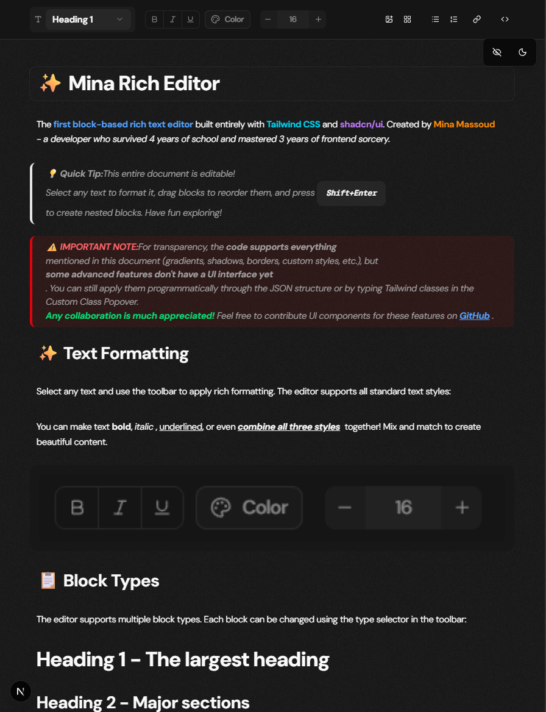

The **first block-based rich text editor** built entirely with **Tailwind CSS** and **shadcn/ui**. Created by [Mina Massoud](https://mina-massoud.com/) - a 22 years old developer with a lot of passion to change people's lives! 😄

[](https://github.com/Mina-Massoud/mina-rich-editor)
[](https://www.typescriptlang.org/)
[](https://reactjs.org/)
[](https://tailwindcss.com/)

> ⚠️ **IMPORTANT NOTE:** For transparency, the **code supports everything** mentioned in this document (gradients, shadows, borders, custom styles, etc.), but **some advanced features don't have a UI interface yet**. You can still apply them programmatically through the JSON structure or by typing Tailwind classes in the Custom Class Popover. **Any collaboration is much appreciated!** Feel free to contribute UI components for these features.

---

## 🚀 Quick Start

### Installation

```bash
# Clone the repository      
git clone https://github.com/Mina-Massoud/mina-rich-editor.git

# Install and run
npm install
npm run dev
```

### Basic Usage

```tsx
import { EditorProvider } from '@/lib';
import { SimpleEditor } from '@/components/SimpleEditor';

export default function App() {
  return (
    <EditorProvider>
      <SimpleEditor />
    </EditorProvider>
  );
}
```

### Read-Only Mode

```tsx
// Display content without editing
<SimpleEditor readOnly={true} />
```

### With Initial Content

```tsx
import { createDemoContent } from '@/lib/demo-content';

const initialContent = {
  id: 'root',
  type: 'container',
  children: createDemoContent(),
  attributes: {}
};

<EditorProvider initialContainer={initialContent}>
  <SimpleEditor />
</EditorProvider>
```

---

## ✨ Text Formatting

Select any text and use the toolbar to apply rich formatting. The editor supports all standard text styles:

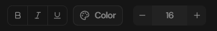

You can make text **bold**, *italic*, <u>underlined</u>, or even ***combine all three styles*** together! Mix and match formatting to create beautiful content.

---

## 📋 Block Types

The editor supports multiple block types. Each block can be changed using the type selector in the toolbar:

- **Heading 1** - The largest heading
- **Heading 2** - Major sections
- **Heading 3** - Subsections
- **Paragraph** - The standard block type for regular text content
- **Blockquote** - Perfect for quotes, tips, and callouts
- **Code Block** - For displaying code with proper formatting
- **List Item** - Ordered and unordered lists

---

## 📝 Lists - Ordered & Unordered

Create ordered lists (numbered) or unordered lists (bullet points) for organized content:

**Ordered List Example (ol)**
1. First item - Automatically numbered
2. Second item - Numbers increment automatically
3. Third item - Perfect for step-by-step instructions
4. You can even add **formatting** to *list items*!

**Unordered List Example (ul)**
- Bullet point item
- Another bullet point
- Great for feature lists
- Supports **rich text formatting** too!

```typescript
// List structure in the editor
const orderedList = {
  id: 'container-1',
  type: 'container',
  attributes: {
    listType: 'ol'  // 'ol' for ordered, 'ul' for unordered
  },
  children: [
    { id: 'li-1', type: 'li', content: 'First item' },
    { id: 'li-2', type: 'li', content: 'Second item' },
    { 
      id: 'li-3',
      type: 'li',
      children: [
        { content: 'Formatted ', bold: false },
        { content: 'item', bold: true }
      ]
    }
  ]
};
```

---

## 🎨 Inline Element Types

Apply heading styles inline within paragraphs. Select text and choose from the element type dropdown to mix different text sizes and styles:

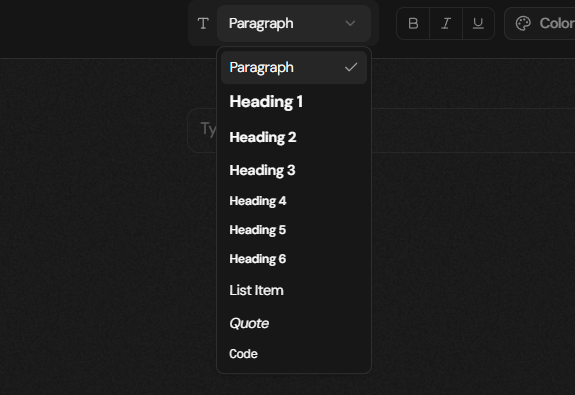

This paragraph contains **H1 styled text** and **H2 styled text** and **H3 styled text** all mixed together, plus `inline code` support for technical content!

```typescript
// Inline element types structure
const richParagraph = {
  type: 'p',
  children: [
    { content: 'Regular text ' },
    { content: 'Large heading', elementType: 'h1' },
    { content: ' and ' },
    { content: 'inline code', elementType: 'code', bold: true }
  ]
};
```

---

## ✏️ Custom Tailwind Classes

> 🤔 Wait, the block above looks a bit weird, right? Oh! I wish I could add custom classes using normal Tailwind... **Actually, you can!** Select your text, then click the **pencil ✏️ smart icon**, and type your class or select from preset classes!

### Custom Class Smart Icon

After selecting text, you'll see a smart pencil icon appear. Click it to access the Custom Class Popover where you can apply any Tailwind CSS class or choose from presets:

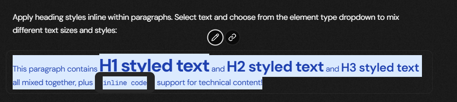

### Custom Class Popover

The Custom Class Popover gives you complete control over text styling with preset Tailwind classes organized by category:

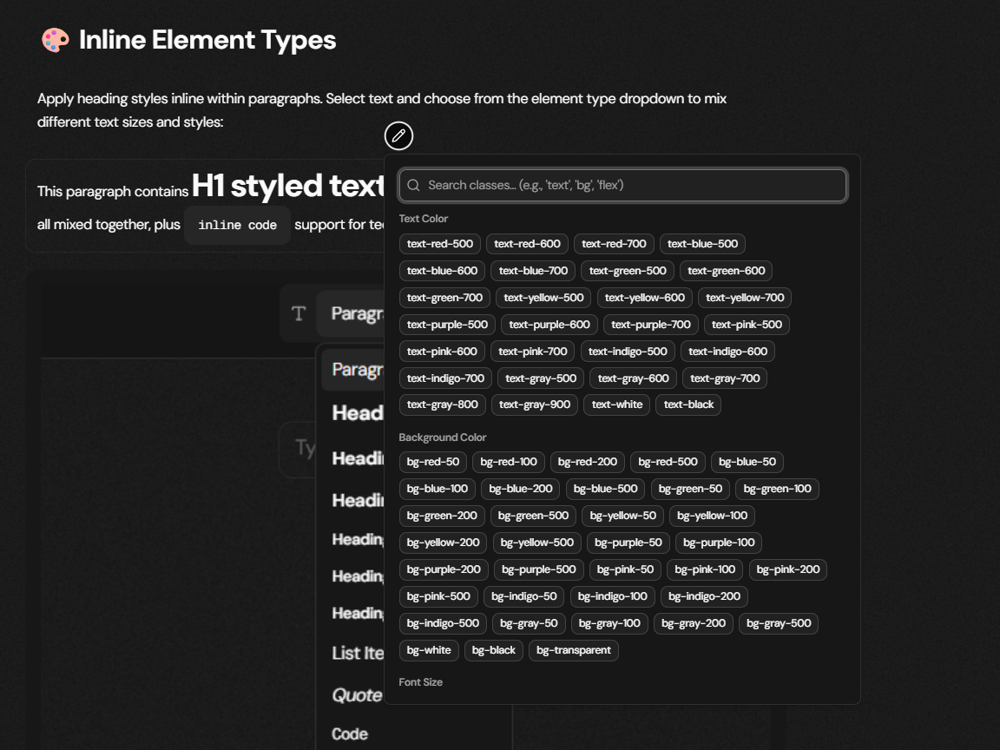

**Features:**
- **Text Colors** - All Tailwind color shades (red, blue, green, etc.)
- **Background Colors** - Full palette of background colors
- **Font Sizes** - From xs to 9xl
- **Search Functionality** - Quick class lookup (e.g., 'text', 'bg', 'flex')
- **Custom Input** - Type any Tailwind class manually

### Much Better Results!

With custom classes, you can create stunning text effects and perfect typography:

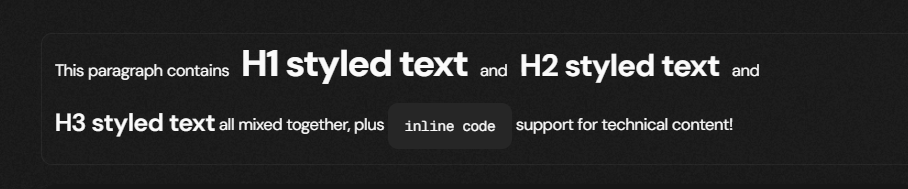

```typescript
// Custom classes with inline element types
const styledText = {
  type: 'p',
  children: [
    { 
      content: 'Gradient heading',
      elementType: 'h1',
      className: 'bg-gradient-to-r from-purple-600 to-pink-600 bg-clip-text text-transparent'
    },
    { content: ' and ' },
    { 
      content: 'custom code',
      elementType: 'code',
      className: 'bg-yellow-100 text-yellow-800 px-2 rounded'
    }
  ]
};
```

> 💡 **Pro Tip:** You can apply **any Tailwind class** including gradients, shadows, borders, spacing, and more! The Custom Class Popover is your gateway to **unlimited styling possibilities**.

---

## 🎨 Color Customization

The editor includes a powerful color picker with preset colors and custom color selection. Apply colors to any selected text:

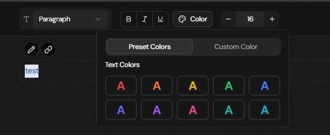

### Preset Colors

<span style="color: #dc2626;">Red</span> <span style="color: #ea580c;">Orange</span> <span style="color: #f59e0b;">Amber</span> <span style="color: #eab308;">Yellow</span> <span style="color: #84cc16;">Lime</span> <span style="color: #22c55e;">Green</span> <span style="color: #10b981;">Emerald</span> <span style="color: #14b8a6;">Teal</span> <span style="color: #06b6d4;">Cyan</span> <span style="color: #0ea5e9;">Sky</span> <span style="color: #3b82f6;">Blue</span> <span style="color: #6366f1;">Indigo</span> <span style="color: #8b5cf6;">Violet</span> <span style="color: #a855f7;">Purple</span> <span style="color: #d946ef;">Fuchsia</span> <span style="color: #ec4899;">Pink</span> <span style="color: #f43f5e;">Rose</span>

### Custom Colors

You can also use custom hex colors or RGB values or even gradient effects by using the color picker!

---

## 📏 Font Size Control

Adjust font sizes for any selected text. Choose from preset sizes or enter a custom value:

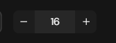

---

## 🎨 Background Colors

Apply background colors to entire blocks using preset Tailwind colors or custom colors. Perfect for highlighting important sections!

---

## 🔗 Link Support

Create beautiful, clickable links with the modern link popover. Select text and add a URL to make it interactive:

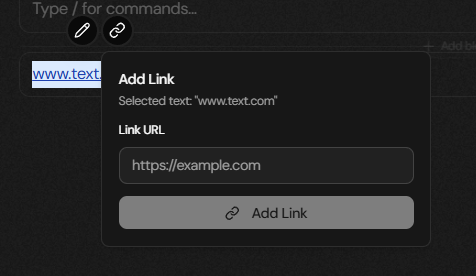

---

## 🖼️ Image Support

Upload and manage images with ease. The editor supports single images, grid layouts, and drag-and-drop reordering:

### Single Image

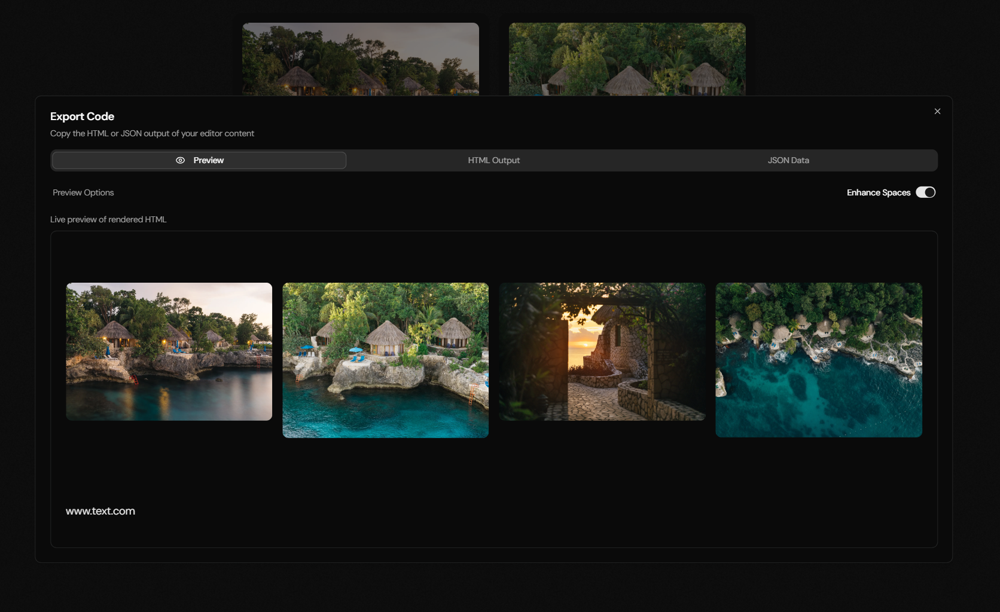

### Image Grid Layout

Create beautiful image galleries with automatic grid layout. Drag and drop images to reorder them:

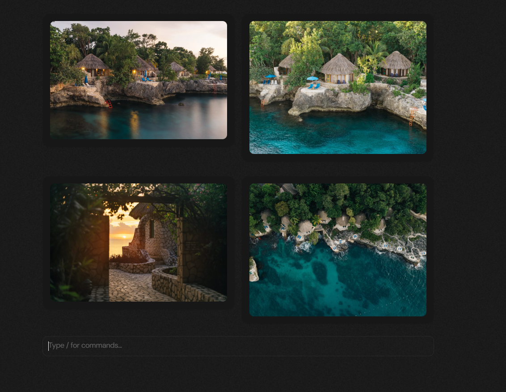

> 💡 **Image Features:** Drag to reorder • Click to upload • Add captions • Responsive grid layout • Support for multiple formats (jpg, png, gif, webp)

---

## 🪆 Nested Blocks

Press **Shift+Enter** to create nested blocks. Maximum nesting level is 1. Great for grouping related content together!

```typescript
// Nested blocks structure
{
  type: 'container',
  children: [
    { type: 'p', content: 'First nested block' },
    { type: 'p', content: 'Second nested block' },
    { type: 'code', content: 'Code in nested block' }
  ]
}
```

---

## 🎯 Drag & Drop

Every block has a drag handle (⋮⋮). Click and drag to reorder blocks, swap images in grids, or reorganize your entire document.

**Drag & Drop Features:**
- Reorder any block
- Swap images in grids
- Move blocks in and out of containers
- Visual feedback during drag
- Auto-scroll support

---

## 📤 HTML Export

Export your entire document to clean, semantic HTML with all Tailwind classes preserved. Perfect for blogs, documentation, and content management:


```typescript
import { serializeToHtml } from '@/lib/utils/serialize-to-html';
import { useEditor } from '@/lib';

function MyComponent() {
  const { state } = useEditor();
  
  // Export to HTML
  const html = serializeToHtml(state.history[state.historyIndex]);
  
  // Returns formatted HTML like:
  // <h1>Title</h1>
  // <p>This is <strong>bold</strong> and <em>italic</em> text.</p>
  // <div class="bg-blue-100 p-4">Custom styled block</div>
  
  return <div dangerouslySetInnerHTML={{ __html: html }} />;
}
```

---

## ⌨️ Keyboard Shortcuts

Master these keyboard shortcuts for a blazing-fast editing experience:

- **Enter** - Create new block after current one
- **Shift + Enter** - Create nested block or add to existing container
- **Ctrl/Cmd + A** - Select all content for copying
- **Backspace/Delete** - Delete current block (when empty)
- **Ctrl/Cmd + B** - Toggle bold formatting on selected text
- **Ctrl/Cmd + I** - Toggle italic formatting on selected text
- **Ctrl/Cmd + U** - Toggle underline formatting on selected text
- **Ctrl/Cmd + Z** - Undo last action
- **Ctrl/Cmd + Shift + Z** - Redo last undone action

---

## 🎯 Complete Feature List

- ✅ **Block-Based Architecture** - Each element is an independent, draggable block
- ✅ **Rich Text Formatting** - Bold, italic, underline, and combinations
- ✅ **Multiple Block Types** - h1-h6, paragraph, code, blockquote, lists (ol/ul)
- ✅ **Inline Element Types** - Mix heading styles within paragraphs
- ✅ **Color Support** - Preset Tailwind colors + custom hex/RGB colors
- ✅ **Font Size Control** - Preset sizes + custom pixel values
- ✅ **Background Colors** - Apply backgrounds to any block with presets or custom colors
- ✅ **Link Support** - Beautiful link popover with URL management
- ✅ **Image Upload** - Single images and grid layouts with drag-to-reorder
- ✅ **Nested Blocks** - Create containers for organizing related content
- ✅ **Drag & Drop** - Reorder blocks, swap images, reorganize everything
- ✅ **Custom Tailwind Classes** - Unlimited styling possibilities with full Tailwind support
- ✅ **HTML Export** - Clean, semantic HTML with preserved styling
- ✅ **TypeScript-First** - Fully typed API with excellent IntelliSense
- ✅ **Immutable State** - Built with reducers for predictable updates
- ✅ **Undo/Redo** - Full history management for all actions
- ✅ **Read-Only Mode** - Perfect for displaying published content
- ✅ **Dark Mode** - Beautiful themes that work everywhere
- ✅ **Keyboard Shortcuts** - Efficient editing with common shortcuts
- ✅ **Context Menu** - Right-click for quick actions (duplicate, delete, move)

---

## 👨‍💻 About the Creator

Built with ❤️ by **Mina Massoud** - Frontend Developer based in Cairo, Egypt 🇪🇬

> "22 years old guy with a lot of passion to change people's lives! 😄"

### Connect with Me

- 🌐 **Portfolio:** [mina-massoud.com](https://mina-massoud.com/)
- 💼 **LinkedIn:** [linkedin.com/in/mina-melad](https://linkedin.com/in/mina-melad/)
- 💻 **GitHub:** [github.com/Mina-Massoud](https://github.com/Mina-Massoud)

---

## 📅 Discover Mina Scheduler

If you love this Rich Editor, check out my other powerful library - a fully customizable calendar scheduler for React!

- ⭐ **560+ Stars on GitHub** - Trusted by developers worldwide
- 🎨 Built with Next UI & shadcn/ui
- 📆 Day, Week, Month Views
- 🎯 Drag & Drop Events
- 💾 State Management with Reducers
- ✨ TypeScript-First with Full Type Safety

**Links:**
- 🔗 **GitHub:** [github.com/Mina-Massoud/mina-scheduler](https://github.com/Mina-Massoud/mina-scheduler)
- 🌐 **Live Demo:** [mina-scheduler.vercel.app](https://mina-scheduler.vercel.app/)

```bash
# Install Mina Scheduler
npm install mina-scheduler

# Use in your React app
import { Scheduler } from 'mina-scheduler';

function App() {
  return <Scheduler events={events} />;
}
```

> 💡 Both libraries share the same philosophy: **beautiful UI, clean code, TypeScript-first, and developer-friendly APIs**. If you enjoy this Rich Editor, you'll love Mina Scheduler!

---

## 🎨 Try It Out!

👉 **Select any text** and use the toolbar above to format it with bold, italic, colors, fonts, and more

👉 Press **Enter** to create new blocks at any time

👉 Press **Shift+Enter** for nested blocks and hierarchical content

👉 Use the **drag handles (⋮⋮)** to reorder blocks and reorganize your document

👉 Toggle **View Only** mode in the top-right to see the read-only version

👉 Switch to **Dark Mode** using the theme toggle for a different experience

👉 Check the **debug panel below** to see JSON structure and export HTML

> 🚀 **Pro Tip:** This is your living documentation! Feel free to edit, experiment, delete sections, add your own content, and explore all features. The editor is designed to be intuitive and powerful - discover features as you use it!

---

## 💖 Thank You!

Thank you for trying **Mina Rich Editor**! This is the **first block-based rich text editor** built entirely with **Tailwind CSS** and **shadcn/ui**. If you find it useful, please star the repository on GitHub and share it with other developers!

⭐ **Star on GitHub:** [github.com/Mina-Massoud/mina-rich-editor](https://github.com/Mina-Massoud/mina-rich-editor)

---

## 📄 License

MIT License - feel free to use in your projects!

---

<div align="center">
  <sub>Built with ❤️ in Cairo, Egypt 🇪🇬 by <a href="https://mina-massoud.com/">Mina Massoud</a></sub>
</div>
